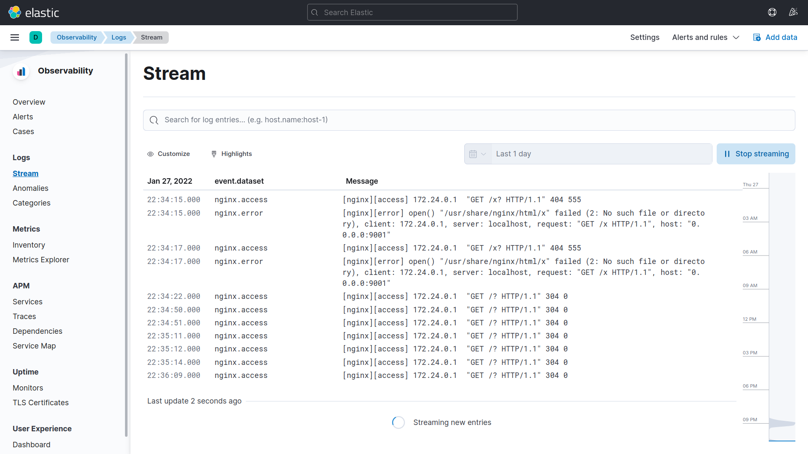
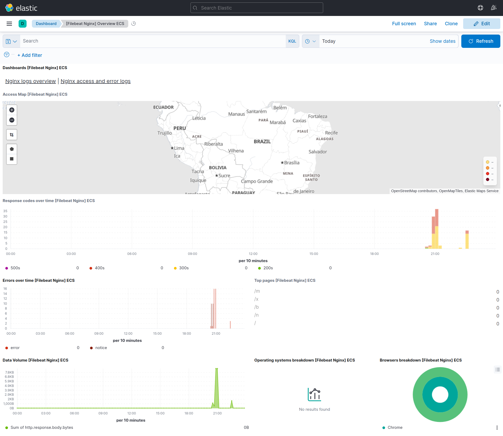
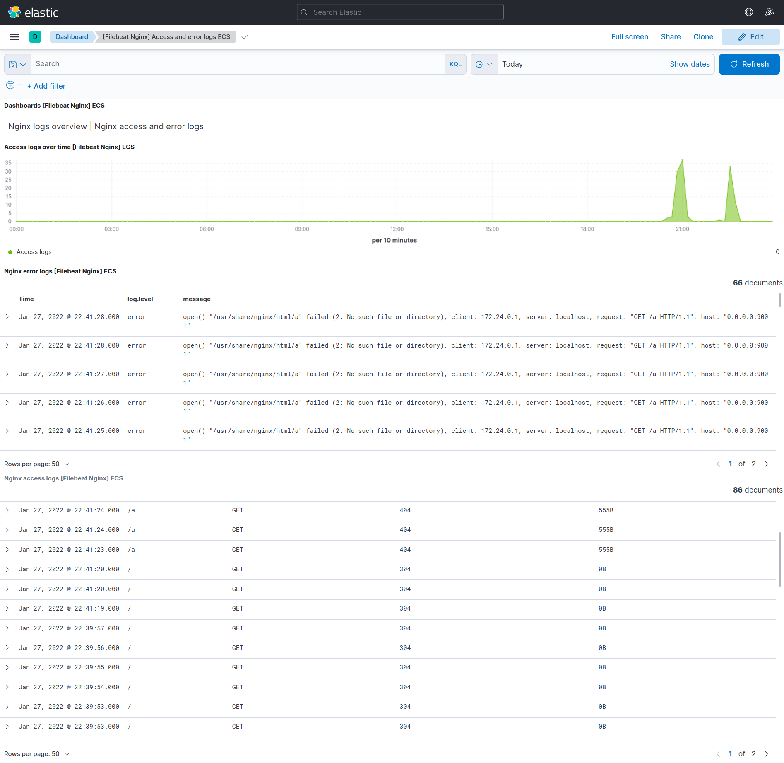

## Observability

This project aims to test the Filebeat Agent to obtain logs of files that Nginx generates and send to Elasticsearch, to concentrate this data and have a more objective view, in addition to the dashboards

Beats is a platform of agents that serve to send data, Filebeat is one of these agents, among others that exist, and the Nginx module is also one of several that exist to perform the integration

## Technologies
This project was made using the follow technologies:

* [Docker](https://www.docker.com)
* [Docker Compose](https://docs.docker.com/compose)
* [Elasticsearch](https://elastic.co)
* [Beats](https://elastic.co/beats)
* [Kibana](https://elastic.co/kibana)
* [Nginx](https://nginx.com)

## Run application

Run containers with Docker Compose to start Elasticsearch, Kibana and Nginx

```bash
docker-compose up -d
```

---

Check that all of the containers went up with

```bash
docker-compose ps
```

If everyone is in the `running` status then the whole environment has risen correctly

---

After all containers start, you must run the Filebeat setup once, for the Dashboards to be created automatically in Kibana.

This process takes a while, just wait

```bash
docker exec -it nginx-beats /bin/bash
filebeat setup
```

Ready just access Kibana and explore the logs and dashboards

http://localhost:5601

## :warning: Troubleshoot Elasticsearch

If the Elasticsearch container doesn't start, the first thing you need to do is look at the logs

```bash
docker logs es01 -f
```

If this is the error:

> Caused by: java.nio.file.**AccessDeniedException**: /usr/share/elasticsearch/data/nodes

This error occurs due to lack of permission in the folders where the Elasticsearch volume is concentrated, there are two ways to solve it, follow the resolution below

**1º** Changing the permissions of the `es01` folder that is on your machine, this folder is generated in an attempt to run the Elasticsearch container

```bash
sudo chown -R 1000:1000 es01
```

**2º** Changing the permissions of the `/usr/share/elasticsearch/data` folder that is in the Elasticsearch container, but there is a problem, the container can't stay UP for a long time so you need to run the commands quickly

```bash
docker start es01 && docker exec -it es01 /bin/bash

# Inside the container run
cd /
chown -R 1000:1000 /usr/share/elasticsearch/data
```

If this is the error:

> es01 exited with code 78

> bootstrap check failure [1] of [1]: max virtual memory areas vm.max_map_count [65530] is too low, increase to at least [262144]

Execute

```bash
sudo sysctl -w vm.max_map_count=262144
```

After these modifications, close all containers and run again

```bash
docker-compose stop
docker-compose down
docker-compose up -d
```

## Generating logs in Nginx for testing

Nginx is running on port 9001, to generate the success and error logs is very easy

For the success logs the only page you need to access is the home page itself: http://localhost:9001

For the error logs, just access any page other than the home page, for example: http://localhost:9001/error


## Observability - Logs



## Observability - Dashboards




